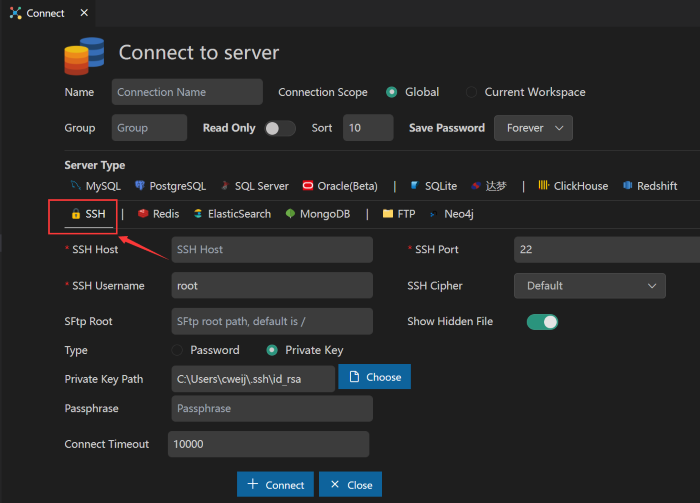
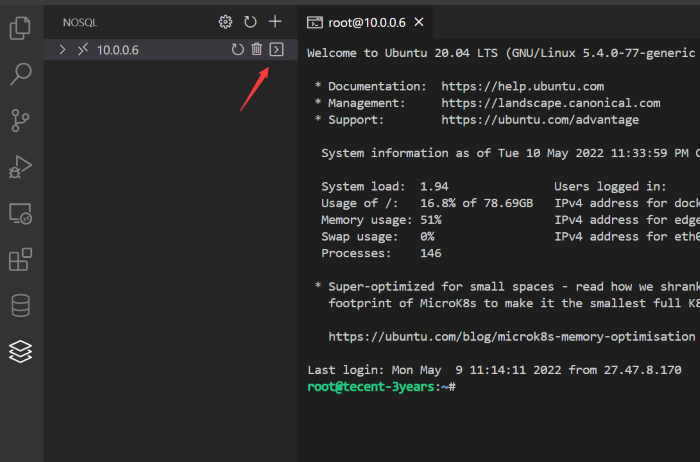
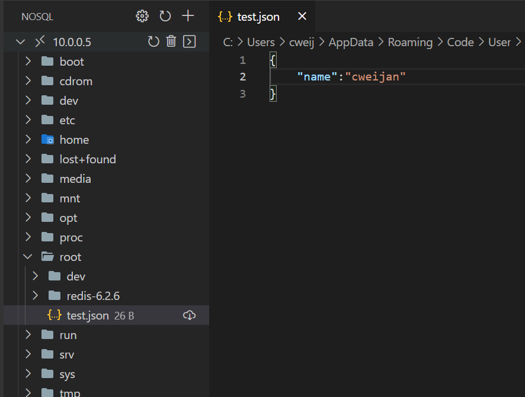
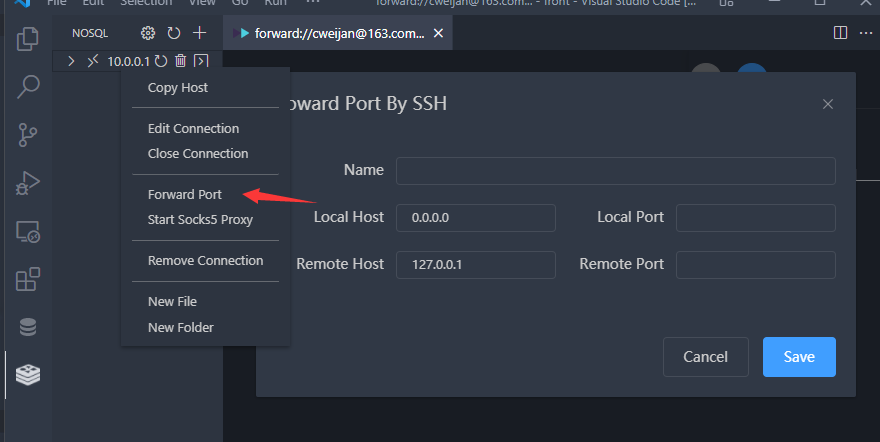

# SSH

本扩展额外提供了SSH支持, 你可将其视为一个SSH客户端使用.

## 终端

通过点击连接旁边的按钮打开交互终端.

## SFTP

当你展开ssh连接节点, 这个扩展将成为一个sftp客户端, 你可通过点击文件节点来查看文件内容.

If you are an premium user, you will also get the following features:

1. 显示隐藏文件.
2. 将在你修改文件后同步到服务器.

## 端口转发

将ssh服务器可以访问到的端口转发到你机器的端口.

